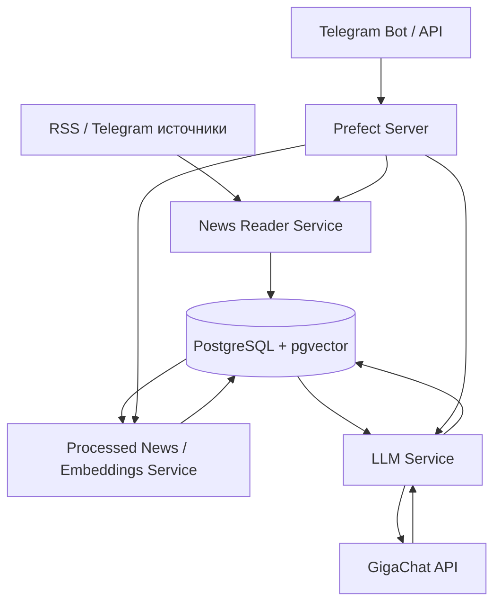

# RAGNews Infrastructure

## Назначение

В этом документе описана инфраструктурная часть проекта **RAGNews**.

Проект строится по микросервисной архитектуре: отдельные части системы запускаются в отдельных контейнерах и имеют собственные зависимости.

На текущем этапе добавлена инфраструктура для:

- единой базы данных проекта;
- хранения новостей, ссылок, обработанных данных и векторов;
- запуска Prefect Server для оркестрации задач;
- отдельного LLM-сервиса для работы с обычным GigaChat API.

---

## Что было добавлено

Добавлены следующие файлы и папки:

```text
docker-compose.llm.yml

docker/
└── postgres/
    └── 01-init.sql

services/
└── llm/
    ├── Dockerfile
    ├── requirements.txt
    ├── .env.example
    └── app/
        └── main.py
```

---

## Общая схема



---

## Контейнеры

В файле `docker-compose.llm.yml` описаны основные сервисы инфраструктуры.

### `postgres`

Контейнер с базой данных **PostgreSQL + pgvector**.

Используется как единая база проекта, в которой хранятся:

- сырые новости;
- обработанные новости;
- ссылки на источники;
- статусы обработки;
- векторные представления новостей;
- пересказы, полученные через GigaChat.

Используется образ:

```yaml
image: pgvector/pgvector:pg16
```

Это PostgreSQL с установленным расширением `vector`, которое позволяет хранить векторы прямо в таблицах.

---

### `prefect-server`

Контейнер с **Prefect Server**.

Prefect используется как оркестратор задач. Через него можно запускать пайплайны обработки новостей:

- сбор новостей;
- очистка;
- дедупликация;
- векторизация;
- суммаризация;
- формирование ответа.

Telegram-бот или другой внешний интерфейс может запускать задачи через Prefect.

---

### `llm-service`

Отдельный FastAPI-сервис для работы с обычным **GigaChat API**.

Сервис отвечает только за генерацию текста через GigaChat:

- пересказ новости;
- выделение темы;
- выделение ключевых слов;
- генерация ответа по уже найденному контексту.

Сервис **не занимается**:

- парсингом RSS;
- парсингом Telegram;
- созданием embeddings;
- векторным поиском;
- дедупликацией;
- логикой Telegram-бота.

---

## Структура базы данных

Инициализация базы описана в файле:

```text
docker/postgres/01-init.sql
```

Файл создаёт:

- пользователя `ragnews`;
- базу данных `ragnews`;
- пользователя `prefect`;
- базу данных `prefect`;
- расширение `vector`;
- основные таблицы проекта.

---

## Таблица `raw_news`

Таблица для хранения необработанных новостей.

В неё попадают данные сразу после сбора из RSS или Telegram.

Основные поля:

| Поле | Назначение |
|---|---|
| `id` | Уникальный идентификатор новости |
| `source_type` | Тип источника: RSS, Telegram и т.д. |
| `source_name` | Название источника |
| `source_url` | Ссылка на источник |
| `title` | Заголовок новости |
| `raw_text` | Исходный текст новости |
| `url` | Ссылка на оригинальную публикацию |
| `published_at` | Дата публикации |
| `fetched_at` | Дата загрузки новости в систему |
| `raw_hash` | Хэш сырого текста для проверки точных дублей |
| `status` | Статус обработки |
| `error_message` | Сообщение об ошибке, если обработка завершилась неуспешно |

Эта таблица нужна, чтобы сохранять оригинальные данные и не терять новость, даже если дальнейшая обработка завершится с ошибкой.

---

## Таблица `processed_news`

Таблица для хранения обработанных новостей.

В неё попадает очищенный текст, результат дедупликации и векторное представление новости.

Основные поля:

| Поле | Назначение |
|---|---|
| `id` | Уникальный идентификатор обработанной новости |
| `raw_news_id` | Ссылка на исходную новость из `raw_news` |
| `clean_title` | Очищенный заголовок |
| `clean_text` | Очищенный текст новости |
| `content_hash` | Хэш очищенного текста |
| `embedding` | Векторное представление новости |
| `is_duplicate` | Признак дубля |
| `duplicate_of` | Ссылка на новость, дублем которой является текущая |
| `processed_at` | Дата обработки |

Поле:

```sql
embedding vector
```

используется для хранения вектора новости внутри PostgreSQL через расширение `pgvector`.

Создание embeddings не относится к зоне ответственности `llm-service`, но база уже подготовлена для этого этапа.

---

## Таблица `summarized_news`

Таблица для хранения пересказов, полученных через GigaChat API.

Основные поля:

| Поле | Назначение |
|---|---|
| `id` | Уникальный идентификатор пересказа |
| `processed_news_id` | Ссылка на обработанную новость из `processed_news` |
| `summary_text` | Краткий пересказ новости |
| `topic` | Определённая тема новости |
| `keywords` | Ключевые слова |
| `gigachat_model` | Использованная модель GigaChat |
| `prompt_version` | Версия промпта |
| `summarized_at` | Дата создания пересказа |

Эта таблица связана с частью `llm-service`, потому что именно LLM-сервис будет получать текст новости, отправлять его в GigaChat и возвращать пересказ.

---

## LLM Service

Папка:

```text
services/llm/
```

содержит отдельный микросервис для работы с обычным GigaChat API.

---

### `services/llm/Dockerfile`

Файл описывает сборку контейнера `llm-service`.

Он выполняет следующие действия:

1. использует образ `python:3.11-slim`;
2. создаёт рабочую директорию `/app`;
3. копирует `requirements.txt`;
4. устанавливает зависимости;
5. копирует код приложения;
6. запускает FastAPI-приложение через `uvicorn`.

---

### `services/llm/requirements.txt`

Файл содержит зависимости только для LLM-сервиса.

Используемые зависимости:

| Зависимость | Назначение |
|---|---|
| `fastapi` | Создание HTTP API |
| `uvicorn` | Запуск FastAPI-сервиса |
| `gigachat` | Работа с обычным GigaChat API |
| `python-dotenv` | Загрузка переменных окружения |
| `pydantic` | Описание схем запросов и ответов |
| `pydantic-settings` | Работа с настройками сервиса |
| `tenacity` | Повторные попытки при ошибках API |
| `orjson` | Быстрая работа с JSON |

В этот файл не добавлены зависимости для парсинга, векторизации и работы с БД, потому что это не зона ответственности `llm-service`.

---

### `services/llm/.env.example`

Шаблон переменных окружения для LLM-сервиса.

Пример:

```env
GIGACHAT_CREDENTIALS=put_your_gigachat_credentials_here
GIGACHAT_SCOPE=GIGACHAT_API_PERS
GIGACHAT_VERIFY_SSL_CERTS=false
LOG_LEVEL=INFO
```

Настоящие ключи не должны попадать в Git.

Для локального запуска нужно создать копию:

```powershell
copy services\llm\.env.example services\llm\.env
```

И заполнить файл `services/llm/.env` реальными значениями.

---

### `services/llm/app/main.py`

Основной файл FastAPI-приложения.

Сейчас в сервисе подготовлены следующие эндпоинты:

```text
GET  /health
POST /summarize
POST /rag-answer
```

---

## Эндпоинт `/health`

Проверяет, что сервис запущен.

Пример запроса:

```powershell
curl http://localhost:8001/health
```

Пример ответа:

```json
{
  "status": "ok",
  "service": "llm-service",
  "responsibility": "GigaChat API text generation only"
}
```

---

## Эндпоинт `/summarize`

Эндпоинт для пересказа новости.

Он должен принимать текст новости и отправлять его в обычный GigaChat API.

Пример входных данных:

```json
{
  "title": "OpenAI представила новую модель",
  "text": "Полный текст новости...",
  "source_url": "https://example.com/news"
}
```

Ожидаемый результат:

```json
{
  "summary": "Краткий пересказ новости...",
  "topic": "AI",
  "keywords": ["OpenAI", "модель", "искусственный интеллект"]
}
```

На текущем этапе эндпоинт подготовлен как заглушка. Реальное подключение к GigaChat API будет добавлено следующим этапом.

---

## Эндпоинт `/rag-answer`

Эндпоинт для генерации ответа по RAG.

Важно: `llm-service` не выполняет векторный поиск самостоятельно.

Он принимает:

- вопрос пользователя;
- уже найденные релевантные новости;
- ссылки на источники.

После этого сервис отправляет вопрос и контекст в обычный GigaChat API и возвращает готовый ответ.

Пример входных данных:

```json
{
  "question": "Что нового про OpenAI?",
  "sources": [
    {
      "title": "OpenAI представила новую модель",
      "text": "Текст найденной новости...",
      "url": "https://example.com/news",
      "source_name": "Example News"
    }
  ]
}
```

Ожидаемый результат:

```json
{
  "answer": "По найденным новостям известно, что...",
  "used_sources": [
    "https://example.com/news"
  ]
}
```

---

## Зона ответственности

### Что относится к текущей инфраструктурной части

- Docker-конфигурация для запуска сервисов.
- PostgreSQL + pgvector как единая база проекта.
- Первичная структура таблиц.
- Prefect Server для запуска задач.
- Отдельный контейнер `llm-service`.
- Отдельный `requirements.txt` для `llm-service`.
- Заготовка FastAPI-сервиса для работы с обычным GigaChat API.

---

### Что относится к `llm-service`

`llm-service` отвечает за:

- отправку текста новости в GigaChat;
- получение краткого пересказа;
- отправку вопроса и найденного контекста в GigaChat;
- получение ответа по RAG-контексту;
- возврат результата другим сервисам.

---

### Что не относится к `llm-service`

`llm-service` не отвечает за:

- сбор новостей из RSS;
- сбор новостей из Telegram;
- очистку текста;
- дедупликацию;
- создание embeddings;
- векторный поиск;
- сохранение результата в БД;
- работу Telegram-бота.

---

## Почему используется PostgreSQL + pgvector

В проекте нужна единая база, где можно хранить и обычные данные, и векторы.

PostgreSQL удобен для хранения структурированных данных:

- новостей;
- ссылок;
- статусов;
- ошибок;
- связей между таблицами;
- результатов обработки.

Расширение `pgvector` позволяет дополнительно хранить векторные представления новостей и выполнять векторный поиск.

Таким образом, PostgreSQL + pgvector используется как единая векторно-реляционная база данных проекта.

---

## Запуск

### 1. Создать локальный env-файл

```powershell
copy services\llm\.env.example services\llm\.env
```

После этого нужно заполнить `services/llm/.env` реальными данными для GigaChat API.

---

### 2. Запустить инфраструктуру

```powershell
docker compose -f docker-compose.llm.yml up -d --build
```

---

### 3. Проверить контейнеры

```powershell
docker compose -f docker-compose.llm.yml ps
```

---

### 4. Проверить LLM-сервис

```powershell
curl http://localhost:8001/health
```

---

### 5. Остановить контейнеры

```powershell
docker compose -f docker-compose.llm.yml down
```

---

### 6. Остановить контейнеры и удалить данные БД

```powershell
docker compose -f docker-compose.llm.yml down -v
```

Команду с `-v` нужно использовать осторожно, потому что она удаляет volume с данными PostgreSQL.

---

## Текущий статус

На текущем этапе подготовлена инфраструктурная основа:

- база данных PostgreSQL + pgvector;
- Prefect Server;
- отдельный LLM-сервис;
- структура таблиц;
- Docker-сборка LLM-сервиса;
- заготовки эндпоинтов `/health`, `/summarize`, `/rag-answer`.

Следующий этап — реализовать реальное подключение к обычному GigaChat API внутри `llm-service`.